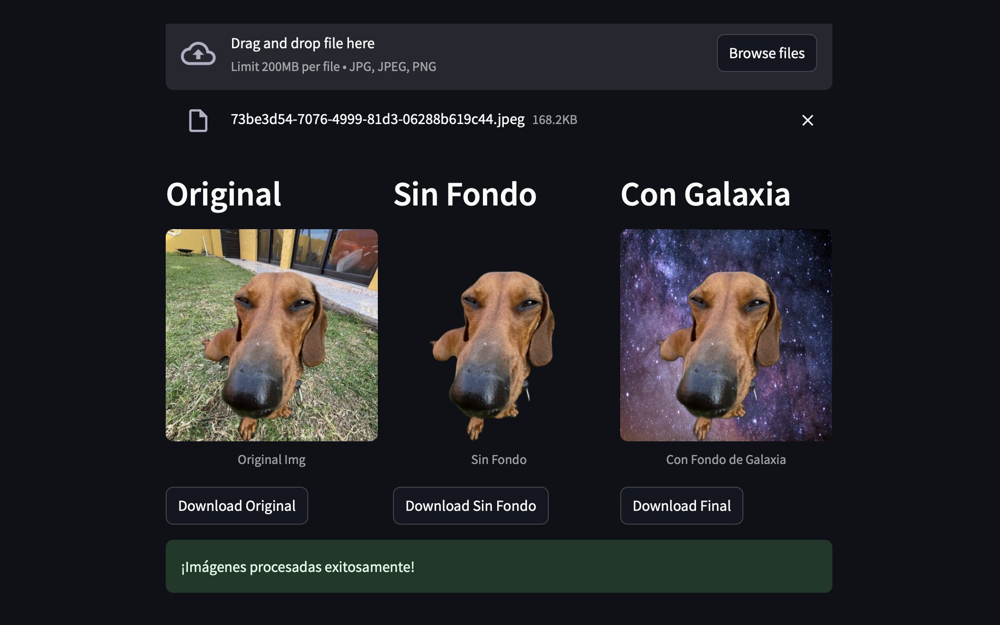

# 🖼️ AI Background Processor

An AI-powered web application that removes backgrounds from images and allows you to add custom backgrounds. Built with Streamlit and the rembg library.



## ✨ Features

- Remove background from images using AI
- Add custom backgrounds:
  - Solid colors
  - Custom images
  - Transparent background
- Process up to 10 images simultaneously
- Real-time progress tracking
- Batch download option
- User-friendly interface

## 🚀 Quick Start

### Prerequisites

- Python 3.8+
- pip (Python package manager)

### Installation

1. Clone the repository:
```bash
git clone https://github.com/valentinolopezbruno/remove-background-py.git
cd remove-background-py
```

2. Create and activate a virtual environment (recommended):
```bash
# Windows
python -m venv venv
venv\Scripts\activate

# Linux/MacOS
python3 -m venv venv
source venv/bin/activate
```

3. Install required packages:
```bash
pip install streamlit pillow rembg
```

4. Create required directories:
```bash
mkdir -p uploads banners images processed_images
```

5. Run the application:
```bash
streamlit run app.py
```

The app will open in your default web browser at `http://localhost:8501`

## 💻 Usage

### Single Image Processing
1. Select "Process Single Image" mode
2. Choose your background option:
   - Transparent
   - Solid color (with color picker)
   - Custom image
3. Upload your image
4. Click "Process Image"
5. Download the processed image

### Multiple Images Processing
1. Select "Process Multiple Images" mode
2. Choose your background option
3. Upload up to 10 images
4. Click "Process Images"
5. Download individual images or get all as ZIP

## 📁 Project Structure

```
ai-background-processor/
├── app.py                 # Main application file
├── banners/              # Directory for background images
├── images/              # Directory for batch processing
├── uploads/            # Temporary directory for uploads
├── processed_images/   # Output directory
├── requirements.txt    # Python dependencies
└── README.md
```

## ⚙️ Technical Details

- Built with Streamlit for the web interface
- Uses rembg for AI-powered background removal
- Supports JPG, JPEG, and PNG formats
- Processes images in memory to avoid storage issues
- Automatically cleans up temporary files

## 📝 Limitations

- Maximum 10 images per batch
- Supported formats: JPG, JPEG, PNG
- Maximum file size: 5MB per image
- Requires internet connection for first-time model download

## 🔧 Troubleshooting

### Common Issues

1. **ModuleNotFoundError**: Run `pip install -r requirements.txt`
2. **Memory Error**: Reduce image size or process fewer images
3. **Directory Error**: Ensure all required directories exist

### Error Messages

- "Please select maximum 10 images": Reduce the number of selected images
- "Error processing image": Try with a different image or format

## 🤝 Contributing

1. Fork the repository
2. Create your feature branch
3. Commit your changes
4. Push to the branch
5. Create a Pull Request

## 🙏 Acknowledgments

- [rembg](https://github.com/danielgatis/rembg) for the background removal
- [Streamlit](https://streamlit.io/) for the web framework
- [Pillow](https://python-pillow.org/) for image processing


