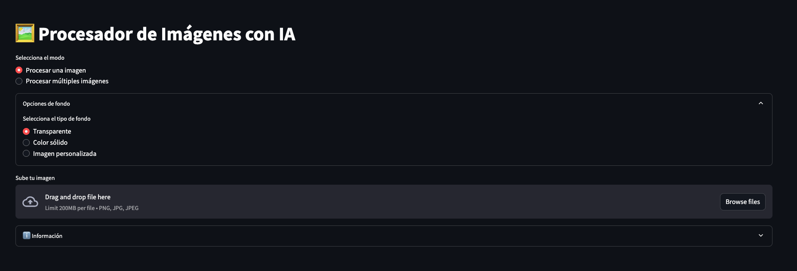

# AI Image Background Processor



A Streamlit application that removes backgrounds from images and adds a galaxy background. The app can process single images or entire folders of images.

## Supported Image Formats

- JPG/JPEG
- PNG

## Features

- Remove background from images using AI
- Add galaxy background automatically
- Process single images with preview
- Batch process entire folders
- Download processed images
- Progress tracking for batch operations

## Requirements

- Python 3.8+
- PIL (Pillow)
- Streamlit
- rembg

## Installation

1. Clone the repository.
2. Create and activate a virtual environment (optional but recommended).
3. Install the required packages:

```bash
pip install streamlit pillow rembg
```

4. Create the required folders:

```bash
mkdir -p uploads processed_images banners images
```
### Processing Single Images

1. Select the "Process Single Image" tab
2. Upload an image using the file uploader
3. View the three versions of your image:
   - Original image
   - Image with removed background
   - Final image with galaxy background
4. Download any version using the download buttons

### Processing Multiple Images
1. Place your images in the `images` folder
2. Select the "Process Folder" tab
3. Enter the folder path (default: "./images")
4. Click "Process Folder"
5. Monitor progress in the app
6. Find processed images in the `processed_images` folder


## Usage

1. Make sure you have your galaxy background image in the `banners` folder named `banner-galaxia.jpeg`

2. Run the Streamlit app:

```bash
streamlit run app.py
```


